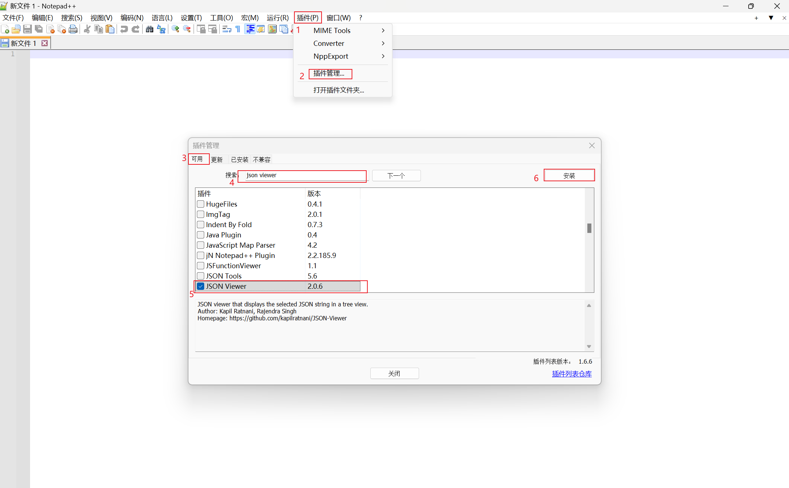

# base64 使用说明

简介：本项目为纯 JavaScript 手写，用于 vmess 协议修改参数，==直接下载 HTML 即可使用==，内含注释，仅供各位交流学习使用。（注：中文乱码不影响使用）

解码后可使用 [Notepad++](https://notepad-plus-plus.org/) 或其他工具查看

# Notepad++ 使用

1. 安装插件

    打开 Notepad++，选择插件 > 插件管理 > 可用 > 搜索关键词 json viewer 即可找到 JSON Viewer，勾选 JSON viewer 并点击安装，根据提示点击确定完成安装

    

2. 粘贴解码后的内容，按快捷键==CTRL + SHIFT + ALT +M==即可格式化 json
